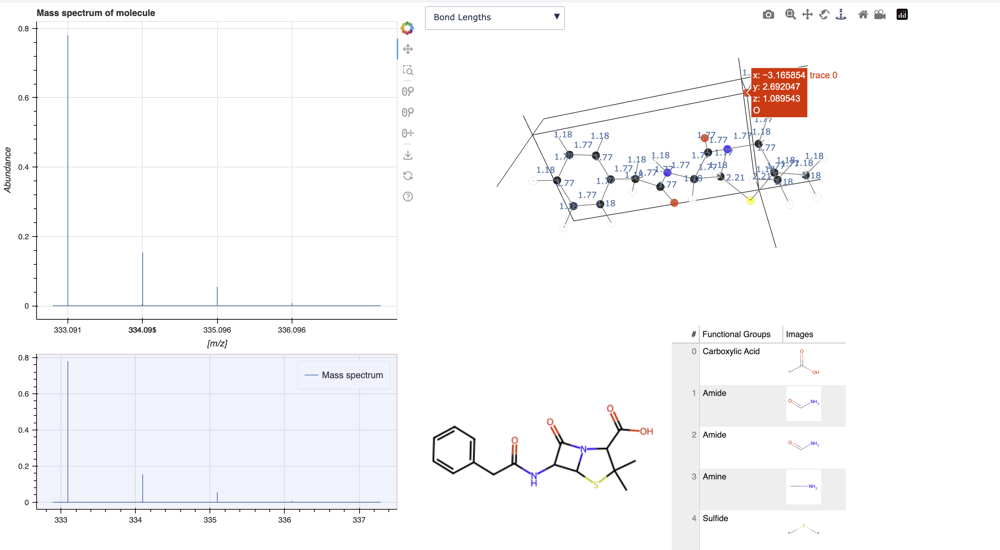

[](https://github.com/ThomasCsson/MASSIVEChem)
[](https://www.python.org/)

[](https://jupyter.org/)


# -         MASSIVEChem       - 

[](https://pypi.org/user/Arthur.hmy/)
[](https://www.python.org)
[](https://github.com/ThomasCsson/MASSIVEChem/graphs/contributors)
[](https://github.com/ThomasCsson/MASSIVEChem/blob/main/LICENSE.txt)
[](https://edu.epfl.ch/studyplan/en/bachelor/chemistry-and-chemical-engineering/coursebook/practical-programming-in-chemistry-CH-200)


 - Python package for applied analytical chemistry focused primarily on mass spectrometry 
#### Project within _practical programming in chemistry_ course -- EPFL CH-200
##### (Grade obtained: 5.75/6)


## 🧪 Package description
[](https://x.com/pschwllr/status/1760713822111723990)
[](https://www.python.org/)

MASSIVEChem, which stands for "Mass Analytical Spectrometry System for Investigation and Visual Extrapolation in Chemistry", is a pip-installable python package developped at EPFL in 2024 focused on, as its name would suggest, analytical chemistry.
The aim of this package is to provide the user with functions in order to simulate the mass spectrum of a molecule and to display this spectrum on a graph. The package also provides other features that can facilitate the chemical analysis of a molecule such as a functional group finder and an unsaturation calculator.

Developpers:
- Thomas Christiansson, student in chemical engineering at EPFL    [](https://github.com/ThomasCsson)
- Igor Gonteri, student in chemistry at EPFL                             [](https://github.com/igorgonteri)
- Arthur Humery, student in chemical engineering at EPFL                [](https://github.com/Arthurhmy)

### 🔬 What is mass spectrometry ?

Mass spectrometry (MS) is an analytical technique used to measure the mass-to-charge ratio of ions. It helps identify the structure of the chemical compound present in a sample by generating a spectrum of the masses of its ions. The process involves two main steps:

Ionisation: The sample is ionised, which means its molecules are converted into charged particles (ions). This can be done using various methods, such as electron impact (EI), electrospray ionisation (ESI), or matrix-assisted laser desorption/ionisation (MALDI). In this case, the ionisation is set to the most commonly used method; deprotonation.

Mass Analysis: The ions are separated based on their mass-to-charge ratio (m/z). This is usually done using a mass analyser, such as a quadrupole, time-of-flight (TOF), or an ion trap. Each type of mass analyser works differently but ultimately serves to distinguish ions by their specific $\frac{m}{z}$ values. The unit of these $\frac{m}{z}$ values is 1 [Th] or 1 $[\frac{Da}{e}]$.

On the y axis of the output spectrum, the relative abundance of the different ions is plotted. This abundance is given by the different natural abundances of the different isotopes of the atoms in the molecule. For example, the relative abundance of $^{13}C$ is 1.1% and that of $^{12}C$ is 98.9%.

Mass spectrometry is widely used in various fields, including:

Chemistry, for molecular identification and structural elucidation. Biochemistry, for studying proteins, peptides, and other biomolecules. Pharmaceuticals, for drug development and metabolite analysis. Environmental Science, for detecting pollutants and analysing environmental samples. Clinical Diagnostics, for identifying biomarkers and analysing complex biological samples. The technique's sensitivity, accuracy, and ability to analyse complex mixtures make it an essential tool in both research and applied sciences.

The mathematical reasoning behind the calculation of these relative abundances is simply applying combinatorics to each isotope of each atom in the given molecule.

To find the probability of a molecule composed of isotopes $I_{1}$ , $I_{2}$ , ... , $I_{n}$ is given by the following formula:

$Pr(I_{1},I_{2},...,I_{n})$ = $Pr(I_{1})$ $\cdot$ $Pr(I_{2})$ $\cdot$ ... $\cdot$ $Pr(I_{n})$

This probability is then the relative abundance of the molecule composed of those isotopes.

Now, let us go through the steps required to use this package!

## 🛠️ Installation
[](https://pypi.org/project/MASSIVEChem/)

MASSIVEChem can be installed using pip as
```bash
pip install MASSIVEChem
```


[](https://github.com/ThomasCsson/MASSIVEChem?tab=readme-ov-file)

Alternatively, the package can be directly installed from the GitHub repository via pip using the following command in the terminal
```bash
pip install git+https://github.com/ThomasCsson/MASSIVEChem
```


The package can also be installed from source by running the following commands

First, clone the repository from github and go in the folder. 
```bash
git clone https://github.com/ThomasCsson/MASSIVEChem.git
cd path/to/MASSIVEChem
```
Then, install the package using : 
```bash
pip install -e .
```

## 📚 Requirements
The package runs on python 3.10 but supports python 3.8 through 3.10.
It requires several other packages to function correctly.

```bash
bokeh
rdkit
panel
```

(Note: panel is not directly used, but is required for added functionality involving the 3 dimmensinal visualisation of the input molecule)

If all goes well during installation, the preceding packages should all install automatically.
But this can be checked by veryfying that they have all been installed in the desired environment. To do this, simply write the following command in the terminal:

```bash
pip show MASSIVEChem
```

If not, install them using the following commands. (Bear in mind that the package will not run without its dependencies. 

```bash
pip install bokeh
pip install rdkit
pip install panel
pip install xyz2graph
```


## 💻 Usage

The principal function of this package takes the SMILEs of a molecule as an input and displays the mass spectrum of the molecule as well as the molecule itself and  the functional groups it contains.

An example on how to make the function work is shown below for benzylpenicilin:

The ionization method is set to monodeprotonation and the resolution of the apparatus is set to 0.01 Th

```bash
import MASSiveChem.MASSiveChem as MC
from bokeh.plotting import show

mol_smi = 'CC1(C(N2C(S1)C(C2=O)NC(=O)CC3=CC=CC=C3)C(=O)O)C'
apparatus_resolution = 0.01

show(MC.spectrum(mol_smi, True, apparatus_resolution))


#The first input in MC.spectrum is the molecule under SMILEs representation,
#and the third is the resolution of the apparatus (typically, this value is of 0.01)
#the second computes an approximate spectrum if True and the precise spectrum if False

```

The output of this command will be:


Note that here there appear to be two overlapping peaks at ~ 334 [th]. This is due to the presence of an odd number of sulphur atoms. This causes there to be a peak 0.004 [th] infront of the second peak. This can be verified by zooming in on the sectrum:


It is also possible to add to the plot an interactive 3D plot of the input molecule.

To do so, type the following command:

```bash
import MASSiveChem.MASSiveChem as MC

mol_smi = 'CC1(C(N2C(S1)C(C2=O)NC(=O)CC3=CC=CC=C3)C(=O)O)C'
imprecision = True
apparatus_resolution = 0.01

spectrum_3D = MC.spectrum_3D(mol_smi, imprecision, apparatus_resolution)

spectrum_3D.show()
```
The output of the command will be the following: 




## 🔧 Trouble shooting

If there is a problem with the functions of the package, first, verify that your version is up to date. To do this, type the following command into the terminal:
```bash
pip show MASSIVEChem
```
You can then compare the version that you have downloaded to that of the newest available version, which can be found on the PiPy page, https://pypi.org/project/MASSIVEChem/

Then, if the version donwloaded is not the newest one, type the following command into the terminal:
```bash
pip install MASSIVEChem -U
```

If problems persist, please feel free to contact any of the developpers for the package.


## 🚀 Getting started

To begin to use the package, the following jupyter notebook will give you information about all of its functions:

[](https://github.com/ThomasCsson/MASSIVEChem/blob/main/notebooks/project_report.ipynb)


## Fun !
🐰 If you've made it this far through our project, you might want to try to find the hidden easter egg in this ReadMe :)🐰

(_hint: you might want to try clicking on various badges throughout the ReadMe_)

##Note
All of this information is valid as of March 2025, if any discrepencies are noticed, please forward them to either of the main developpers of the package.
