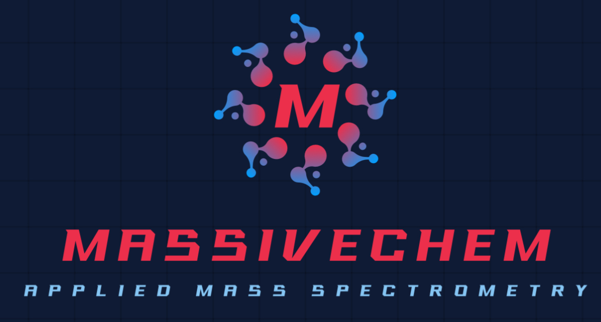

# -         MASSIVEChem       - 
 - Python package for applied analytical chemistry focused primarily on mass speectrometry 
#### Project in practical programming in chemistry course -- EPFL CH-200

## Package description 
MASSIVEChem, which stands for "Mass Analytical Spectrometry System for Investigation and Visual Extrapolation in Chemistry", is a pip-installable package developped at EPFL in 2024 focused on, as its name would suggest, analytical chemistry.
The aim of this package is to provide the user functions in order to simulate the mass spectrum of a molecule and to display this spectrum on a graph. The package also provides other features that can facilitate the chemical analysis of a molecule such as a functional group finder and an unsaturation calculator.

Developpers:
- Thomas Viking Christiansson, student in chemical engineering at EPFL    https://github.com/ThomasCsson
- Igor Gonteri, student in chemistry at EPFL                             https://github.com/igorgonteri
- Arthur Humery, student in chemical engineering at EPFL                https://github.com/Arthurhmy

### What is mass spectrometry ?
   - Mass spectrometry is an analytical technique used to identify and quantify chemical compounds in a sample by measuring the mass and sometimes the charge of molecules. It involves separating pre-charged ions according to their mass-to-charge ratio (m/z), then detecting and analysing them. This method is widely used in chemistry, biochemistry, pharmacology and other fields to characterise substances and understand their composition.

Now, let us go through the steps required to use this package !

## Installation

MASSIVEChem can be installed using pip as
```bash
pip install MASSIVEChem
```
The package can also be installed from source by running the following commands

First, clone the repository from github and go in the folder. 
```bash
git clone https://github.com/ThomasCsson/MASSIVEChem.git
cd MASSIVEChem
```
Then, install the package using : 
```bash
pip install -e . 
```

## Requirments
The package runs on python 3.10 but supports python 3.8 through 3.10
The package requires several other packages to function correctly.

```bash
matplotlib
bokeh
rdkit
pandas
```
If everything runs in order during the installation, the preceding packages should install automatically.
But check that these packages are correctly installed using 

```bash
pip show "name of the package"
```

If not, install them using the following commands, otherwise the package will not work. 

```bash
pip install matplotlib
pip install bokeh
pip install rdkit
pip install pandas
```

## Usage

The principal function of this package takes the SMILEs of a molecule as an input and displays the mass spectrometry of the molecule as well as the molecule itself and  the functional groups it contains.

An example on how to make the function work is shown below for penicilin:

```bash
import MASSIVEChem as ms
from ms.MASSIVEChem import spectrum
from bokeh.plotting import show

mol_smi = 'CC1(C(N2C(S1)C(C2=O)NC(=O)CC3=CC=CC=C3)C(=O)O)C'

show(spectrum(mol_smi))
```

## Getting started

To begin to use the package the following jupyter notebook will give you information about all the package's functions:

'''link to jupter notebook'''

